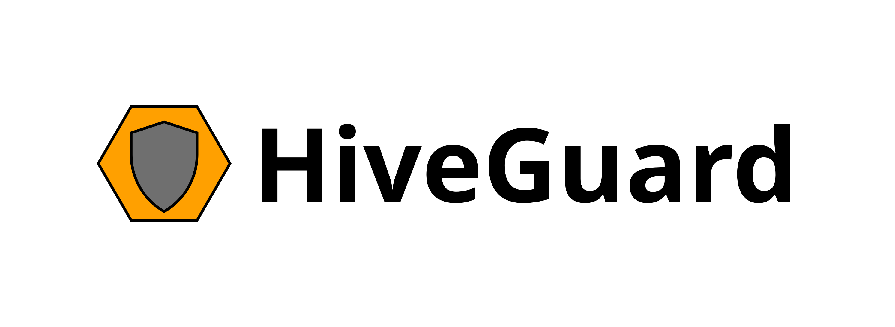
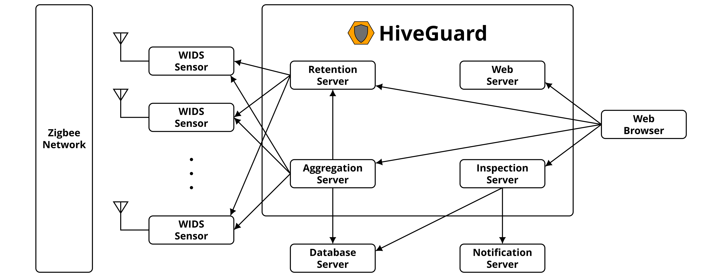

# hiveguard

HiveGuard: A distributed system for monitoring the security of Zigbee networks


## Instructions

Currently, you can install the HiveGuard command-line interface as follows:
```console
$ git clone https://github.com/akestoridis/hiveguard.git
$ git clone https://github.com/akestoridis/hiveguard-backend.git
$ git clone https://github.com/akestoridis/hiveguard-frontend.git
$ cd hiveguard-frontend/
$ npm install
$ npm run build
$ cd ../
$ cd hiveguard-backend/
$ npm install
$ cd ../
$ cd hiveguard/
$ npm install
```

Then, you can select the HiveGuard backend servers that you would like to launch and define the necessary environment variables by executing the following command:
```console
$ npm run start
```

You can also override the default configuration by providing a configuration file, e.g.:
```console
$ npm run start config.prod.json
```


## Architecture




## Publication

HiveGuard was used in the following publication:

* D.-G. Akestoridis and P. Tague, “HiveGuard: A network security monitoring architecture for Zigbee networks,” to appear in Proc. IEEE CNS’21.


## Acknowledgments

This project was supported in part by the CyLab Security and Privacy Institute.


## License

Copyright 2021 Dimitrios-Georgios Akestoridis

This project is licensed under the terms of the Apache License, Version 2.0 (Apache-2.0).
